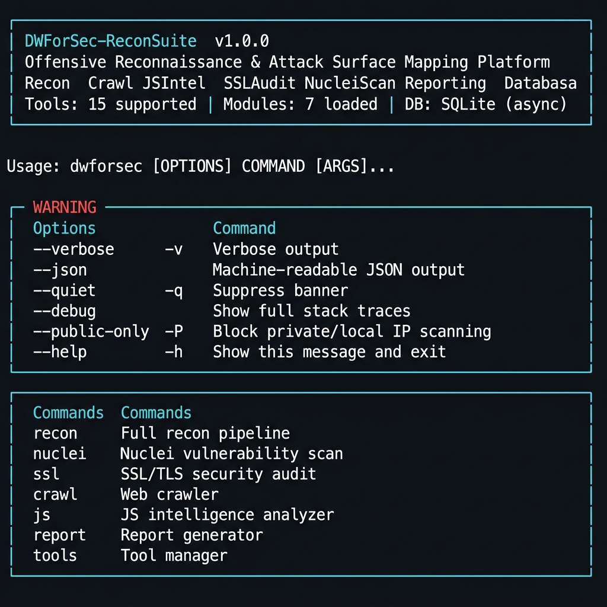
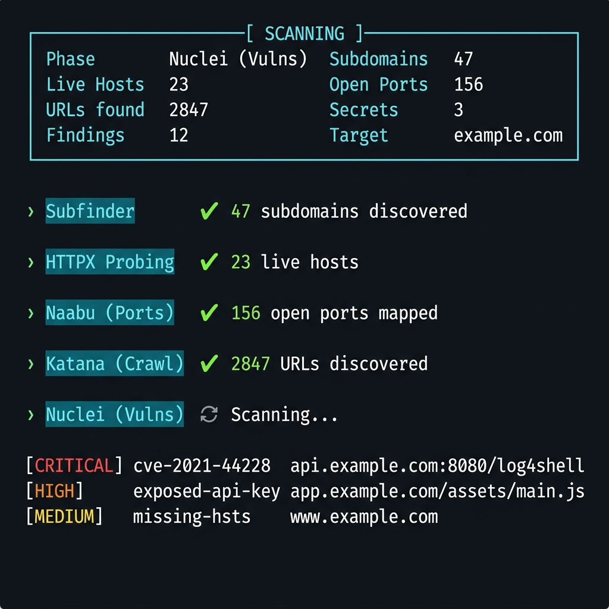
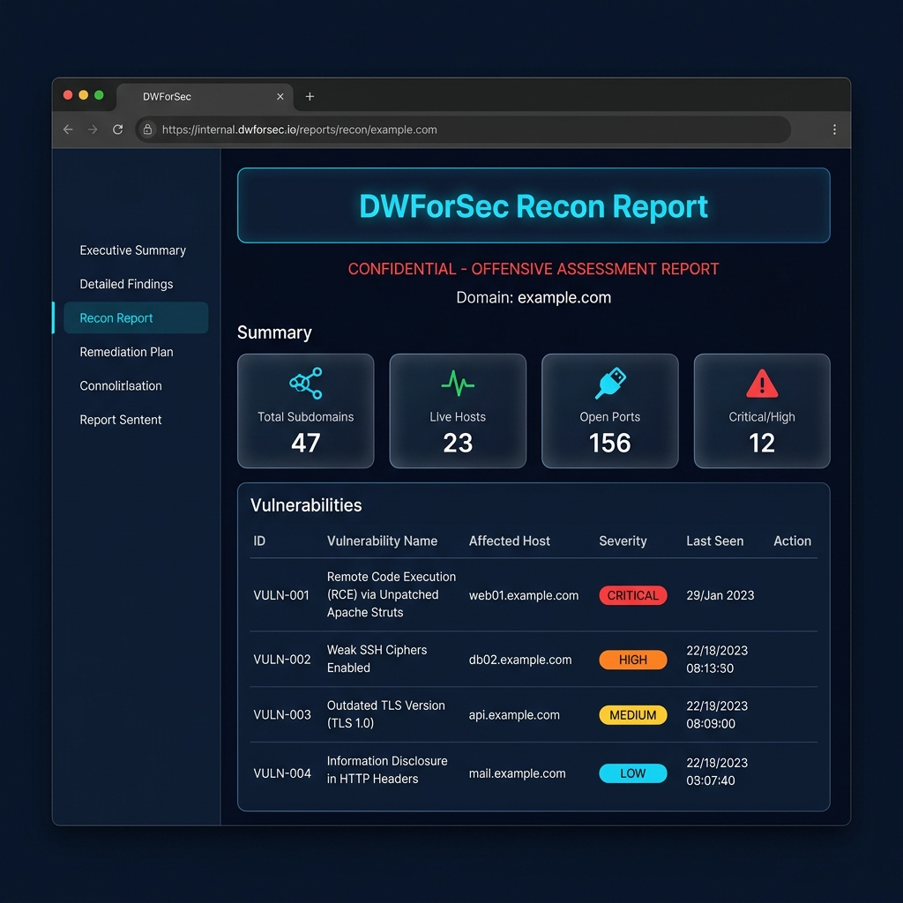

<p align="center">
  
</p>

<h1 align="center">DWForSec-ReconSuite</h1>
<p align="center">
  <b>Offensive Reconnaissance &amp; Attack Surface Mapping Platform</b><br/>
  <sub>Async · Modular · 15 Tools · Python Fallbacks · Multi-Format Reports</sub>
</p>

<p align="center">
  
  
  
  
</p>

---

## Overview

DWForSec-ReconSuite is a production-ready offensive reconnaissance framework for security researchers, bug bounty hunters, and red team operators.

- **15 external tools** integrated with intelligent Python fallbacks  
- **Full async pipeline** — subdomain enumeration → live probing → port scan → crawl → JS analysis → Nuclei → SSL audit  
- **Multi-format reports** — HTML, Markdown, PDF, JSON, TXT  
- **Operator-friendly CLI** — simple commands, aliases, interactive menu  

---

## Installation

```bash
git clone https://github.com/DWForSec/DWForSec-ReconSuite.git
cd DWForSec-ReconSuite
pip install .
```

After install, `dwforsec` is available **globally**:

```bash
dwforsec -h
```

---

## Usage

### Full Recon Pipeline

```bash
dwforsec recon example.com
```

<p align="center">
  
</p>

Automatically runs all 8 phases and saves results to SQLite database with a Scan ID.

---

### All Commands

```bash
# Full reconnaissance pipeline
dwforsec recon example.com
dwforsec recon example.com --public-only    # Block private IP ranges
dwforsec recon example.com --json           # Machine-readable output

# Nuclei vulnerability scan
dwforsec nuclei https://example.com

# SSL/TLS audit
dwforsec ssl example.com

# Web crawler
dwforsec crawl https://example.com

# JavaScript intelligence (file or URL)
dwforsec js app.js
dwforsec js https://example.com/assets/main.js
dwforsec js app.js --reveal                 # Show unmasked secrets

# Generate reports
dwforsec report 1                           # HTML (default)
dwforsec report 1 --format pdf
dwforsec report 1 --format md
dwforsec report 1 --all                     # All formats at once

# Tool manager
dwforsec tools status
dwforsec tools install
```

### Shorthand Aliases

```bash
dwforsec r example.com          # recon
dwforsec n https://example.com  # nuclei
dwforsec s example.com          # ssl
dwforsec c https://example.com  # crawl
dwforsec j app.js               # js
```

### Interactive Mode

```bash
dwforsec     # No arguments → interactive menu
```

```
 Select Operation
┌────┬──────────────────────────┐
│ [1]│ Full Recon Pipeline      │
│ [2]│ Nuclei Vulnerability Scan│
│ [3]│ SSL / TLS Audit          │
│ [4]│ Web Crawler              │
│ [5]│ JS Secret Analysis       │
│ [6]│ Generate Report          │
│ [7]│ Tool Status              │
│ [0]│ Exit                     │
└────┴──────────────────────────┘
  Choice [0]: _
```

---

## Global Flags

| Flag              | Short | Description                          |
|:------------------|:------|:-------------------------------------|
| `--verbose`       | `-v`  | Verbose output                       |
| `--json`          |       | Machine-readable JSON output         |
| `--quiet`         | `-q`  | Suppress banner                      |
| `--debug`         |       | Show full stack traces               |
| `--public-only`   | `-P`  | Block private/local IP ranges        |

---

## Real-World Workflow

```bash
# 1. Check which tools are installed
dwforsec tools status

# 2. Install missing tools (requires Go)
dwforsec tools install

# 3. Run full recon against a target
dwforsec recon example.com --public-only

# 4. Analyze a JavaScript file from the crawl results
dwforsec js https://example.com/static/bundle.js

# 5. Run focused vulnerability scan
dwforsec nuclei https://example.com

# 6. Audit SSL/TLS configuration
dwforsec ssl example.com

# 7. Generate all report formats from Scan ID 1
dwforsec report 1 --all
```

---

## Report Output

<p align="center">
  
</p>

Reports are saved to `outputs/reports/<format>/`:

| Format | Path |
|:-------|:-----|
| HTML   | `outputs/reports/html/dwforsec-report-*.html` |
| PDF    | `outputs/reports/pdf/dwforsec-report-*.pdf`   |
| Markdown | `outputs/reports/markdown/dwforsec-report-*.md` |
| JSON   | `outputs/reports/json/dwforsec-report-*.json` |
| TXT    | `outputs/reports/txt/dwforsec-report-*.txt`   |

---

## Recon Pipeline Phases

```
Phase 1   Subfinder + Assetfinder + Amass     Subdomain enumeration
Phase 2   HTTPX                               Live host probing + tech detection
Phase 3   Naabu + Nmap                        Port scan + service fingerprint
Phase 4   Wafw00f                             WAF detection
Phase 5   Katana + GAU + Waybackurls          URL crawling + archive mining
Phase 6   JS Secret Analyzer                 API key, JWT, AWS credential detection
Phase 7   Nuclei                              Vulnerability scanning
Phase 8   SSLScan                             TLS protocol + cipher audit
          ↓
          SQLite database save (async)
          Auto-generated HTML report
```

> **Resilience:** Every phase has a Python fallback. The framework runs even if external binaries are missing.

---

## Installing External Tools

```bash
# Windows PowerShell
dwforsec tools install

# Linux / macOS
dwforsec tools install
```

Requires **Go** to compile ProjectDiscovery tools (Subfinder, HTTPX, Nuclei, Katana, Naabu).  
Missing tools are replaced with Python-native fallbacks automatically.

---

## Shell Autocomplete

```bash
dwforsec --install-completion bash
dwforsec --install-completion zsh
dwforsec --install-completion powershell
```

---

## Project Structure

```
dwforsec/
├── cli/
│   ├── main.py              Entrypoint, interactive menu, aliases
│   ├── context.py           Global flag propagation
│   ├── output.py            Rich theming and output helpers
│   └── commands/            recon, nuclei, ssl, crawl, js, report, tools
├── core/                    Config, logging, banner, constants
├── database/                SQLAlchemy async ORM (SQLite / PostgreSQL)
├── models/                  Pydantic schemas
├── services/
│   ├── recon/               15 tool services (all with Python fallbacks)
│   ├── parser/              Nuclei, Nmap, SSL, HTTPX output parsers
│   └── analyzer/            JS secrets, SSL weakness, risk classification
├── reports/                 HTML, Markdown, PDF, JSON, TXT exporters
└── utils/                   Subprocess runner, validator, sanitize
scripts/
├── install-tools.ps1        Windows installer
└── install-tools.sh         Linux/macOS installer
```

---

## License

[MIT License](LICENSE) © 2025 DWForSec

---

> **Security Notice:** This framework is intended strictly for **authorized security testing** on assets you own or have explicit written permission to assess.
